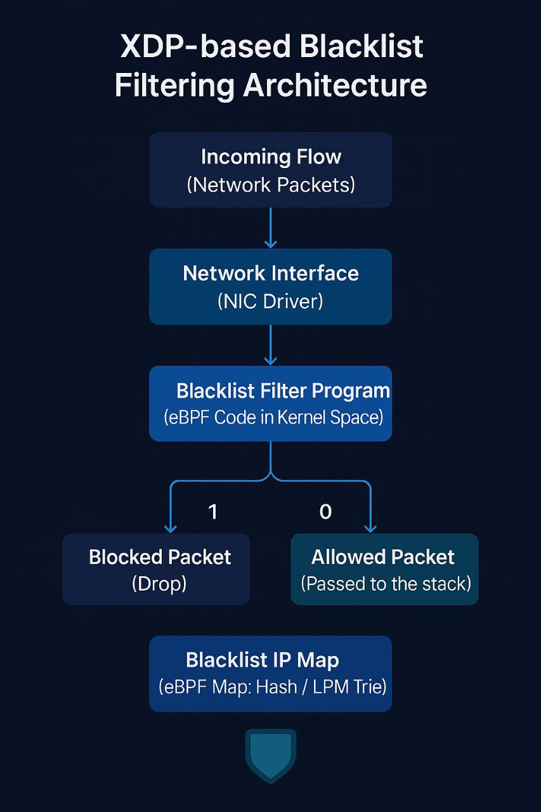

# 🕳️ Blackhole

**Blackhole** is an XDP-based packet filtering tool that allows fine-grained banning of traffic based on various criteria such as source/destination IPs, ports, and interfaces using eBPF maps.



---

## ✨ Features

You can ban or allow traffic based on:

- Blocking based on a specific **Source IP** (SIP)
- Blocking based on a specific **Destination IP** (DIP)
- Blocking based on a specific **Source–Destination IP pair**
- Blocking based on a **three-tuple** (Source IP, Destination IP, Port), e.g., blocking a specific SSH connection
- Blocking based on a specific **Port** (e.g., port 22)
- Blocking based on a specific **Protocol** (e.g., ICMP)
- Blocking traffic on a specific **Network Interface**

---
## 🛠 Building the Project

To compile all components, simply run:

```bash
make
```

The compiled binaries and object files will be placed under the `build/` directory:

- `build/blacklist.o` – the XDP object file
- `build/blacklist_config_writer` – the configuration generator
- `build/blacklist_map` – the eBPF map loader

---

## 🚀 Running the Program

Use the provided run script to start everything:

```bash
sudo ./Run.sh
```

The script will:
1. Ask you to enter the **network interface name** (e.g., `enp0s1`)
2. Load the compiled XDP program onto the selected interface
3. Execute `blacklist_config_writer` to generate a config
4. Load values into eBPF maps using `blacklist_map`

> **Note:** The script requires `sudo` privileges to attach the XDP program and access system resources.

---
## 🛑 Stopping and Unloading
If you want to stop the packet filtering and remove the XDP program from the network interface, use the provided unload script:

```bash
./Unload.sh
```
The script will:

1. Identify the network interface where the program is attached.
2. Detach the XDP program from the interface.
3. Clean up the eBPF maps associated with the filter.

> **Warning:** Once unloaded, all traffic previously blocked by Blackhole will be allowed again immediately.

---
## 📦 Requirements

- Clang / LLVM (for compiling the XDP program)
- libbpf-dev
- libjansson-dev
- GCC
- Linux kernel with eBPF/XDP support

### Debian / Ubuntu

```bash
sudo apt update
sudo apt install clang llvm gcc libbpf-dev libxdp-dev xdp-tools bpftool linux-headers-$(uname -r) libjansson-dev
```

### RHEL / CentOS / Fedora

```bash
sudo dnf install clang llvm gcc libbpf libbpf-devel libxdp libxdp-devel xdp-tools bpftool kernel-headers
```

To install **libjansson** on RHEL-based systems, enable EPEL repository and then install:

```bash
sudo dnf install epel-release
sudo dnf install jansson-devel
```
---
